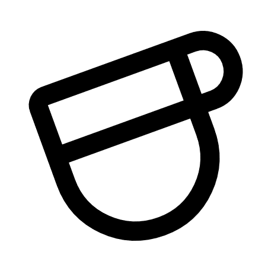

# Estación del Sabor

Enlace repositorio: https://github.com/martinetbn/estacion-del-sabor

Enlace página: https://martinetbn.github.io/estacion-del-sabor

# Presentación del proyecto

## Síntesis

Nuestro proyecto trata sobre un sitio web de una cafetería en la cual se pueden encontrar promociones e información útil sobre ésta como el menú, ubicación y reseñas.

## Actividad principal de la empresa

La empresa es una cafetería que cambia su menú en cada estación del año, proporcionando a los clientes una experiencia renovada y acorde con la temporada. La paleta de colores también acompaña este cambio.

## Objetivo principal del sitio

Se busca atraer a los visitantes con promociones de cada estación, ofreciendo un sitio interesante y fácil de usar. Por ejemplo, en verano se muestra el Frappé en la página principal incluyendo una paleta de colores llamativa.

## Objetivo secundario y estrategias para atraer a los usuarios

Como objetivo secundario,  se busca reducir el tiempo que le toma a los clientes hacer el pedido: pueden acceder al menú inmediatamente usando un código QR. De esta manera, también se da a conocer el sitio web.

# Perfil del proyecto

El sitio está dirigido a jóvenes de 16 a 24 años de ambos sexos, que disfrutan del momento compartido entre amigos, y que les interesa disfrutar de una experiencia culinaria temática y estacional. Principalmente argentinos, de un poder adquisitivo medio/alto, buscando un refugio donde poder hacer un intercambio social.

# Características visuales

## Logo

## Paleta de colores

La paleta de colores varía dependiendo de cada estación: en verano usamos tonos amarillos, en otoño anaranjados, en inverno azules y en primavera verdes.

### Verano

## Estilo

Minimalista.

## Palabras clave

Estación, café, verano, otoño, invierno, primavera.

## Eslogan

Cada estación es única.

## Imagen general que se desea transmitir

Amigable.

# Descripción del sitio web

# Rol de cada integrante

Diseñador UX/UI: Martín Etchebarne
Programador: Florencia Acosta, Martín Etchebarne, Matías Flores, Michelle Perna
Comunicador Web: ?
